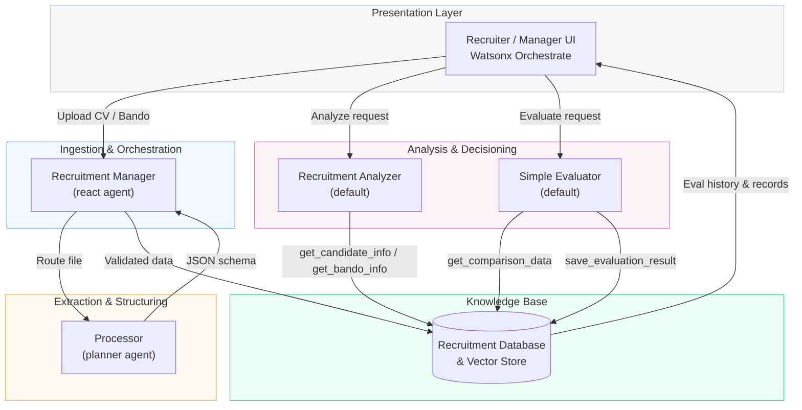

# 🤖 IBM Consulting – AI‑ Recruitment & Tender Matching Suite  
*A watsonx Orchestrate reference solution & developer kit*

[]() 
[]()

> End‑to‑end agentic AI that ingests CVs and _Bandi di Gara_ (client tenders), structures the data, and ranks the best‑fit candidates for every project—all deployable , which ships inside this repository.

---

## 🗺️ Table of Contents
1. [Solution Overview](#solution-overview)  
2. [Key Features](#key-features)  
3. [System Architecture](#system-architecture)  
4. [Core Agents](#core-agents)  
5. [Quick Start](#quick-start)  
6. [Makefile Command Reference](#makefile-command-reference)  
7. [Folder Layout](#folder-layout)  
8. [Contributing](#contributing)  
9. [License](#license)  

---

## Solution Overview

Recruiters spend countless hours parsing résumés and matching them to client requirements.  
This project delivers a **four‑layer watsonx Orchestrate solution** that:

* **Automatically** extracts structured data from any CV or _Bando di Gara_ document.  
* **Continuously** evaluates candidate ↔ project fit using a transparent scoring rubric.  
* **Stores** every decision in JSON for auditability & analytics.  
* **Runs anywhere**—Mac, Ubuntu, or CI—thanks to the included **Watsonx Orchestrate DevKit Installer**.

---

## Key Features
| Area | Highlights |
|------|------------|
| **Document Ingestion** | Drag‑and‑drop CVs / tenders; auto‑type detection; real‑time status feedback. |
| **Data Extraction** | Llama‑3‑powered _Processor_ agent outputs strict JSON schemas for CVs & tenders. |
| **Smart Matching** | _Simple Evaluator_ agent scores 0‑100 with qualitative labels (Excellent → Poor). |
| **Explainability** | Each score includes a 1‑2 sentence rationale & is persisted with an evaluation ID. |
| **Developer UX** | One‑command local stack via the bundled installer. |

---
## System Architecture




* **Recruitment Manager** – detects uploads, routes to Processor, saves to DB.  
* **Processor** – per‑file extraction to strict schema (`CV` or `Bando di Gara`).  
* **Recruitment Analyzer** – one‑item deep‑dive summariser.  
* **Simple Evaluator** – candidate/project scoring & persistence.

---

## Core Agents

| Agent | Purpose | Key Tools |
|-------|---------|-----------|
| **Recruitment Manager** | Orchestrates document flow & DB writes. | `format_and_save_processed_data`, retrieval helpers |
| **Processor** | LLM‑based information extractor (CV / Bando). | — |
| **Recruitment Analyzer** | Detailed single‑item insights. | `get_candidate_info`, `get_bando_info` |
| **Simple Evaluator** | Generates 0‑100 match score + rationale, stores result. | `get_comparison_data`, `save_evaluation_result`, `get_evaluation_results` |

---

## Quick Start

```bash
# 1. Clone
git clone https://github.com/ruslanmv/ai-recruitment-suite.git
cd ai-recruitment-suite

# 2. Copy .env.example → .env and fill credentials

# 3. Install & run (DevKit installer is already included)
make install
make start          # backend
make run            # import agents, start UI

# Open the chat UI
open http://localhost:3000/chat-lite
````

---

## Makefile Command Reference

| Command        | Description                                              |
| -------------- | -------------------------------------------------------- |
| `make install` | ⚙️ Sets up prerequisites, virtual env, ADK (via DevKit). |
| `make start`   | 🚀 Starts the watsonx Orchestrate stack.                 |
| `make run`     | 🏃 Imports all tools & agents, then prompts to open UI.  |
| `make stop`    | 🛑 Stops the server & containers.                        |
| `make purge`   | 🔥 Removes all containers & images.                      |
| `make help`    | ℹ️ Shows command list.                                   |

---

## Folder Layout

```
ai-recruitment-suite/
├─ agents/            # .yaml agent specs (imported by make run)
├─ tools/             # Custom tool Python or OpenAPI files
├─ docker/            # Docker‑compose + service configs
├─ watsonx-orchestrate/            # ⚙️ DevKit Installer scripts (included)
├─ Makefile           # Command runner
├─ README.md
└─ .env.example
```

---

## Contributing

PRs are welcome!
Please open an issue first to discuss major changes.

---

## License

Apache 2.0 – see [LICENSE](LICENSE) for details.

