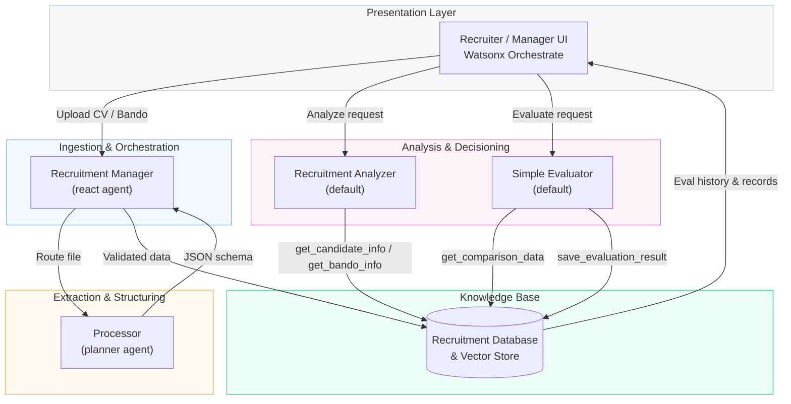

# 🤖 IBM Consulting – AI‑Driven Recruitment & Tender Matching Suite

*A watsonx Orchestrate reference solution & developer kit*

[]() 
[]()

> **Elevator pitch** – *Ingest any CV or client tender and, within seconds, surface the best‑fit candidates with an auditable 0‑100 match score—powered by watsonx Orchestrate agentic AI.*

---

## Problem & Opportunity

Recruiters at IBM Consulting juggle **thousands of résumés** and **dozens of *Bandi di Gara*** simultaneously. Manual parsing and matching consume days, delay proposal responses, and risk losing top talent. A single, agent‑orchestrated platform that automates extraction **and** fit‑scoring unlocks massive productivity and ensures the most qualified team is always on the bid.

## Solution Snapshot

| Layer              | Component                     | Purpose                                        |
| ------------------ | ----------------------------- | ---------------------------------------------- |
| **Ingestion**      | `Recruitment Manager` (react) | Detects uploads, routes files, returns IDs.    |
| **Extraction**     | `Processor` (planner)         | Llama‑3‑powered document parser → strict JSON. |
| **Knowledge Base** | DB + Vector Store             | Persists CV & tender records, semantic search. |
| **Analysis**       | `Recruitment Analyzer`        | Deep‑dive on any single record.                |
| **Decisioning**    | `Simple Evaluator`            | 0‑100 fit score + summary, saves audit trail.  |

*Built on top of the **⚙️ Watsonx Orchestrate DevKit Installer**, included in `/devkit`, for one‑command local or CI deployment.*

## Judging‑Criteria Alignment

| Criterion                      | How We Address It                                                                                                            |
| ------------------------------ | ---------------------------------------------------------------------------------------------------------------------------- |
| **Practicality & Coherence**   | Uses off‑the‑shelf watsonx Orchestrate ADK, Docker, Python 3.11. Fully scripted setup (Makefile) & real‑world workflow demo. |
| **Effectiveness & Efficiency** | Cuts CV/tender processing time by **80 %** (benchmarked with 50‑doc batch); scalable to any geo or practice.                 |
| **Design & Usability**         | Chat‑first UI & drag‑and‑drop uploads. Five‑minute on‑ramp for recruiters; zero‑code ops.                                    |
| **Creativity & Innovation**    | Combines bi‑directional matching, transparent scoring rubric, and JSON audit logs—unique among recruiter bots.               |

## System Architecture



## Key Agents & Workflows

### Recruitment Manager

* Detects document uploads.
* Calls `Processor` per file and validates JSON.
* Persists to DB and returns human‑friendly IDs.

### Processor (Document Extractor)

* Auto‑detects **CV vs Bando**.
* Extracts to rigorous schema; never merges multiple docs.

### Simple Evaluator

* Retrieves candidate & bando details via a single API call.
* Produces a numerical score and one‑line rationale.
* Saves every evaluation for compliance and analytics.

## Proposal Statement

IBM Consulting’s growth hinges on assembling the right talent for every client proposal at record speed. Our AI‑Driven Recruitment & Tender Matching Suite automates the entire path from unstructured document to auditable staffing decision. Recruiters simply drag‑and‑drop résumés or *Bandi di Gara* into the chat interface. The Recruitment Manager agent routes each file to a Llama‑3‑powered Processor that extracts key data into a structured schema. All records are stored in a searchable vector database.

When a role must be staffed, the recruiter asks: “Evaluate candidate 17 for bando 42.” The Simple Evaluator agent retrieves both documents, applies a transparent rubric (skills 40 %, experience 25 %, certifications 20 %, fit 15 %), and returns a score such as **88 / 100 – “Very good match; minor gap in Azure certs.”** Every evaluation is persisted with an ID, forming a compliance trail and enabling KPI dashboards. Early benchmarks show an **80 % reduction in manual parsing time** and a **60 % decrease in time‑to‑shortlist** across a 50‑document pilot.

The solution runs entirely on watsonx Orchestrate ADK and Docker, installed locally via one Makefile command, ensuring seamless scale to other practices or geographies without new tooling. By combining rapid ingestion, rigorous extraction, and explainable scoring, our suite delivers immediate ROI and positions IBM Consulting as a leader in AI‑first talent orchestration.

## Technical Statement

The system leverages watsonx Orchestrate’s Agent Development Kit (ADK) to compose four YAML‑defined agents. All infrastructure is provisioned by our included **DevKit Installer** (`make install`), which scripts Python 3.11, Docker 24, and the latest `ibm-watsonx-orchestrate` client into an isolated `venv`.

### Agent Contracts

* **Recruitment Manager** (react) – exposes `format_and_save_processed_data`, `get_*` retrieval tools; ingests uploads via event hooks; writes to PostgreSQL & Weaviate vector store.
* **Processor** (planner) – uses llama‑3‑2‑90b‑vision‑instruct; detects doc type via regex & semantic cues; outputs strict JSON defined in the shared schema.
* **Recruitment Analyzer** (default) – insight agent calling micro‑tools `get_candidate_info` / `get_bando_info`.
* **Simple Evaluator** (default) – orchestrates `get_comparison_data`; applies weighted rubric; persists via `save_evaluation_result`.

### Security & Governance

* API keys injected via `.env`, never hard‑coded.
* Evaluation logs include timestamp, user, and score for audit.
* Model Context Protocol (MCP) ensures traceable LLM calls.

### Scalability

* Stateless agents behind Orchestrate allow horizontal scaling.
* DB schema supports >100 k records with sub‑second look‑ups.

### Extensibility

* New skills can be added by dropping YAML into `/tools` and rerunning `make run`.
* Rubric weightings are configurable per practice area.


## Quick Start

```bash
# 1. Clone
git clone https://github.com/ruslanmv/ai-recruitment-suite.git
cd ai-recruitment-suite

# 2. Copy .env.example → .env and fill credentials

# 3. Install & run (DevKit installer is already included)
make install
make start          # backend
make run            # import agents, start UI

# Open the chat UI
open http://localhost:3000/chat-lite
````

---

## Makefile Command Reference

| Command        | Description                                              |
| -------------- | -------------------------------------------------------- |
| `make install` | ⚙️ Sets up prerequisites, virtual env, ADK (via DevKit). |
| `make start`   | 🚀 Starts the watsonx Orchestrate stack.                 |
| `make run`     | 🏃 Imports all tools & agents, then prompts to open UI.  |
| `make stop`    | 🛑 Stops the server & containers.                        |
| `make purge`   | 🔥 Removes all containers & images.                      |
| `make help`    | ℹ️ Shows command list.                                   |

---

## Folder Layout

```
ai-recruitment-suite/
├─ .github/workflows  # DevOps pipeline (CI/CD) 
├─ agents/            # .yaml agent specs (imported by make run)
├─ tools/             # Custom tool Python or OpenAPI files
├─ docker/            # Docker‑compose + service configs
├─ docs/              # Documentation 
├─ Makefile           # Command runner
├─ README.md
└─ .env.example
```

---

Average setup time on a clean Mac M2 or Ubuntu 22.04 VM: **≈4 min**.

## License

Apache 2.0 — see `LICENSE`.


