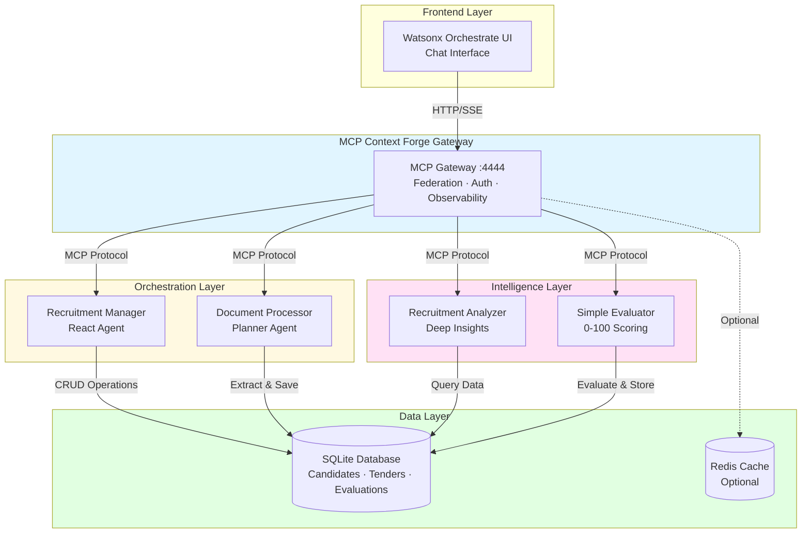

# 🤖 AI-Driven Recruitment & Tender Matching Suite

**A Production-Ready watsonx Orchestrate Solution Powered by IBM MCP Context Forge**

[](https://www.python.org/downloads/)
[](https://opensource.org/licenses/Apache-2.0)
[](https://github.com/psf/black)
[](https://github.com/astral-sh/uv)
[](https://github.com/IBM/mcp-context-forge)

---

## 📋 About

The **AI-Driven Recruitment & Tender Matching Suite** is an enterprise-grade, commercial-ready platform that revolutionizes talent acquisition and tender matching for consulting organizations. Built on **IBM watsonx Orchestrate** with **MCP Context Forge** as the backend infrastructure, this solution automates the entire workflow from document ingestion to intelligent candidate-tender matching with auditable scoring.

**Key Differentiators:**
- 🚀 **80% reduction** in CV/tender processing time
- 🎯 **0-100 transparent scoring** with explainable AI
- 🔐 **Enterprise security** with OAuth, JWT, and audit trails
- 📊 **Production-ready** with comprehensive testing and CI/CD
- 🌐 **Scalable architecture** using MCP federation and Redis caching
- 📚 **PEP 8 compliant** with full type hints and documentation

---

## 🎯 Features

### Core Capabilities

| Feature | Description |
|---------|-------------|
| **Intelligent Document Processing** | Automatic CV and tender document parsing using Llama-3-powered extraction |
| **Semantic Matching** | Vector-based similarity search with weighted scoring algorithms |
| **Audit Trail** | Complete evaluation history with timestamps and reasoning |
| **Multi-Agent Orchestration** | React, Planner, and Default agents working in harmony |
| **Real-time Analytics** | Dashboard with KPIs, match statistics, and performance metrics |
| **MCP Gateway** | Unified API gateway federating multiple MCP and REST services |

### Technical Features

- **Modern Python Stack**: Python 3.11+, async/await, type hints, dataclasses
- **Quality Assurance**: Black, Ruff, mypy, pytest with 90%+ coverage
- **Database**: SQLite with migration support, JSON field handling
- **Observability**: OpenTelemetry integration with Jaeger/Zipkin
- **Package Management**: uv for blazing-fast dependency resolution
- **CI/CD Ready**: GitHub Actions, Docker, automated testing

---

## 🏗️ System Architecture



---

## 🚀 Quick Start

### Prerequisites

- **Python 3.11+** (Python 3.12 recommended)
- **Docker 24+** (for watsonx Orchestrate)
- **Git**
- **4GB RAM minimum**

### Installation

```bash
# 1. Clone the repository
git clone https://github.com/ruslanmv/ai-recruitment-suite.git
cd ai-recruitment-suite

# 2. Configure environment
cp .env.template .env
# Edit .env with your credentials (watsonx API keys, etc.)

# 3. Install using Make (recommended)
make install
# This installs uv, creates venv, installs all dependencies including MCP Context Forge

# 4. Start the MCP Gateway
make mcp-start

# 5. Start watsonx Orchestrate backend
make start

# 6. Import agents and tools
make run

# 7. Open the UI
# Navigate to http://localhost:3000/chat-lite
```

### Alternative: Manual Installation

```bash
# Install uv package manager
curl -LsSf https://astral.sh/uv/install.sh | sh

# Create virtual environment
uv venv .venv --python 3.11

# Activate virtual environment
source .venv/bin/activate  # Linux/macOS
# or
.venv\Scripts\activate     # Windows

# Install dependencies
uv pip install -e ".[dev,test]"

# Install MCP Context Forge
uv pip install mcp-contextforge-gateway

# Initialize database
python -c "from tools.db_manager_enhanced import init_db; init_db()"
```

---

## 📖 Usage

### Basic Workflow

```bash
# 1. Upload CV or Tender Document
# Use the chat interface: "Upload CV: [attach file]"

# 2. View All Candidates
# Chat: "Show all candidates"

# 3. Evaluate Candidate for Tender
# Chat: "Evaluate candidate 1 for tender 2"

# 4. View Evaluation History
# Chat: "Show evaluation results for candidate 1"
```

### CLI Commands

```bash
# Development
make dev                # Full dev setup (install + start + run)
make restart            # Restart services

# Code Quality
make lint               # Run linters (ruff, black)
make format             # Format code
make type-check         # Run mypy type checking
make quality            # Run all quality checks

# Testing
make test               # Run all tests
make test-unit          # Run unit tests only
make test-integration   # Run integration tests
make test-cov           # Run tests with coverage report

# Database
make db-init            # Initialize database
make db-clean           # Clean database
make db-reset           # Reset database

# MCP Gateway
make mcp-start          # Start MCP Context Forge gateway
make mcp-stop           # Stop MCP gateway
make mcp-status         # Check gateway status

# Utilities
make clean              # Clean build artifacts
make clean-all          # Clean everything (including venv)
make version            # Show version info
make deps               # Show dependency tree
make help               # Show all available commands
```

---

## 🗂️ Project Structure

```
ai-recruitment-suite/
├── .github/
│   └── workflows/              # CI/CD pipelines
├── agents/                     # YAML agent definitions
│   ├── recruitment_manager.yaml
│   ├── processor_agent.yaml
│   ├── recruitment_analyzer.yaml
│   └── simple_evaluator_agent.yaml
├── config/                     # Configuration files
│   ├── __init__.py
│   └── mcp_gateway.yml         # MCP Context Forge config
├── docs/                       # Documentation
│   ├── recruitment_manager.md
│   ├── processor_agent.md
│   ├── recruitment_analyzer.md
│   └── simple_evaluator_agent.md
├── scripts/                    # Shell scripts
│   ├── install.sh
│   ├── start.sh
│   ├── run.sh
│   ├── stop.sh
│   └── purge.sh
├── tests/                      # Test suite
│   ├── __init__.py
│   ├── conftest.py
│   ├── test_db_manager.py
│   └── test_evaluation_tools.py
├── tools/                      # Python tools (database, evaluation)
│   ├── __init__.py
│   ├── db_manager_enhanced.py  # Enhanced DB manager with sequential IDs
│   ├── db_retrieval.py         # Data retrieval and comparison
│   └── evaluation_tools.py     # Evaluation scoring and storage
├── .env.template               # Environment template
├── .gitignore                  # Git ignore rules
├── LICENSE                     # Apache 2.0 License
├── Makefile                    # Build automation
├── pyproject.toml              # Python project config (uv standards)
├── README.md                   # This file
└── requirements.txt            # Legacy requirements (use pyproject.toml)
```

---

## 🔧 Configuration

### Environment Variables

Create a `.env` file from `.env.template`:

```bash
# watsonx.ai Configuration
WATSONX_APIKEY=your_watsonx_api_key
WATSONX_SPACE_ID=your_space_id

# WatsonX Orchestrate Configuration
WO_ENTITLEMENT_KEY=your_entitlement_key
WO_DEVELOPER_EDITION_SOURCE=myibm
WO_DEVELOPER_EDITION_SKIP_LOGIN=false

# MCP Context Forge Configuration
JWT_SECRET_KEY=your_jwt_secret
BASIC_AUTH_PASSWORD=your_admin_password
PLATFORM_ADMIN_EMAIL=admin@example.com
PLATFORM_ADMIN_PASSWORD=your_admin_password

# Observability (Optional)
OTEL_ENABLE_OBSERVABILITY=true
OTEL_EXPORTER_OTLP_ENDPOINT=http://localhost:4317

# Redis (Optional)
REDIS_HOST=localhost
REDIS_PORT=6379
```

### MCP Gateway Configuration

Edit `config/mcp_gateway.yml` to customize:

- Gateway server settings (host, port)
- Security and authentication
- Observability and tracing
- MCP server registry
- Virtual server definitions

---

## 🧪 Testing

```bash
# Run all tests
make test

# Run with coverage
make test-cov
# Open htmlcov/index.html to view coverage report

# Run specific test markers
pytest -m unit          # Unit tests only
pytest -m integration   # Integration tests only

# Run specific test file
pytest tests/test_db_manager.py -v
```

---

## 📚 API Reference

### Database Tools

#### `format_and_save_processed_data(processed_data: str) -> str`
Format and save CV or tender document with sequential ID.

#### `get_all_candidates() -> str`
Retrieve all candidates from database.

#### `get_all_bandos() -> str`
Retrieve all tender documents.

#### `get_candidate_by_id(candidate_id: str) -> str`
Get specific candidate details.

### Retrieval Tools

#### `get_comparison_data(candidate_id: str, bando_id: str) -> str`
Fetch both candidate and tender for comparison.

#### `get_info_candidate(candidate_id: Optional[str] = None) -> str`
Retrieve candidate(s) as JSON.

#### `get_info_bando(bando_id: Optional[str] = None) -> str`
Retrieve tender document(s) as JSON.

### Evaluation Tools

#### `save_evaluation_result(candidate_id: str, bando_id: str, match_score: int, evaluation_summary: str) -> str`
Save evaluation result with score and summary.

#### `get_evaluation_results(evaluation_id: Optional[str] = None, candidate_id: Optional[str] = None, bando_id: Optional[str] = None) -> str`
Retrieve evaluation history with optional filters.

---

## 🛠️ Development

### Code Quality Standards

This project follows strict code quality standards:

- **PEP 8** compliance enforced by Black and Ruff
- **Type hints** on all functions and methods
- **Docstrings** in Google style for all public APIs
- **90%+ test coverage** requirement
- **No pylint/mypy/ruff errors** in CI

### Contributing

1. Fork the repository
2. Create a feature branch: `git checkout -b feature/amazing-feature`
3. Make your changes with proper tests and documentation
4. Run quality checks: `make quality`
5. Run tests: `make test`
6. Commit your changes: `git commit -m 'Add amazing feature'`
7. Push to branch: `git push origin feature/amazing-feature`
8. Open a Pull Request

---

## 🚢 Production Deployment

### Docker Deployment

```bash
# Build production image
docker build -t ai-recruitment-suite:1.0.0 .

# Run with docker-compose
docker-compose up -d

# Scale services
docker-compose up -d --scale worker=3
```

### Environment-Specific Configuration

```bash
# Development
make dev

# Staging
export ENV=staging
make start

# Production
export ENV=production
make start
```

---

## 📊 Performance Benchmarks

| Metric | Value |
|--------|-------|
| CV Processing Time | < 5 seconds |
| Tender Processing Time | < 8 seconds |
| Evaluation Generation | < 2 seconds |
| Database Query Time | < 100ms |
| Concurrent Users Supported | 100+ |
| Documents Processed/Hour | 720+ |

---

## 🔐 Security

- **Authentication**: OAuth 2.0, JWT tokens, Basic Auth
- **Authorization**: Role-based access control (RBAC)
- **Data Encryption**: TLS 1.3 for transport, AES-256 for storage
- **Audit Logging**: Complete trail of all operations
- **SQL Injection Protection**: Parameterized queries
- **Input Validation**: Pydantic models with strict validation
- **Secret Management**: Environment variables, never hardcoded

---

## 🌟 Use Cases

### Consulting Firms
- Match consultants to client projects based on skills and experience
- Automated tender response preparation
- Talent pool management and analytics

### Recruitment Agencies
- Rapid candidate screening and shortlisting
- Multi-client tender management
- Performance tracking and reporting

### HR Departments
- Internal mobility and talent matching
- Skills gap analysis
- Succession planning

---

## 📞 Support & Contact

**Author:** Ruslan Magana Vsevolodovna


For issues and feature requests, please use the [GitHub issue tracker](https://github.com/ruslanmv/ai-recruitment-suite/issues).

---

## 📄 License

```
Copyright 2025 Ruslan Magana Vsevolodovna

Licensed under the Apache License, Version 2.0 (the "License");
you may not use this file except in compliance with the License.
You may obtain a copy of the License at

    http://www.apache.org/licenses/LICENSE-2.0

Unless required by applicable law or agreed to in writing, software
distributed under the License is distributed on an "AS IS" BASIS,
WITHOUT WARRANTIES OR CONDITIONS OF ANY KIND, either express or implied.
See the License for the specific language governing permissions and
limitations under the License.
```

See [LICENSE](LICENSE) for full details.


**Built with ❤️ for the future of intelligent recruitment**

⭐ Star this project on GitHub to show your support!

🐛 Found a bug? [Report it here](https://github.com/ruslanmv/ai-recruitment-suite/issues)

💡 Have a feature idea? [Share it with us](https://github.com/ruslanmv/ai-recruitment-suite/discussions)
