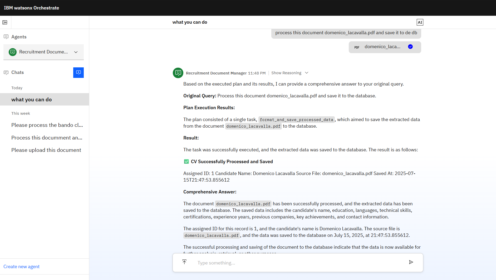

# Recruitment Document Manager Agent Documentation

---

## Overview

The **Recruitment Document Manager** is an intelligent recruitment agent for IBM Consulting. It processes uploaded CV and Bando di Gara (tender) documents, routes them to the processor agent for data extraction, then formats and saves structured data to the recruitment database. It handles both candidate profiles and project opportunities with comprehensive data management capabilities.

---

## Agent Specifications

* **Spec Version:** v1
* **Kind:** native
* **Name:** `recruitment_manager`
* **Display Name:** Recruitment Document Manager
* **Description:** Intelligent recruitment agent that processes uploaded CV and Bando di Gara documents. Automatically routes documents to the processor agent for extraction, then formats and saves the structured data to the database.
* **LLM:** `watsonx/meta-llama/llama-3-2-90b-vision-instruct`
* **Style:** React
* **Primary Function:** Document processing orchestration and database management

---

## Core Workflow

1. **Document Upload Detection**

   * Acknowledge uploads (PDF, Word, Excel) immediately
   * Support batch uploads

2. **Document Routing to Processor**

   * Forward each document to the **processor** agent for extraction
   * Manage inter-agent collaboration

3. **Data Validation**

   * Receive extracted JSON from processor agent
   * Validate schema integrity

4. **Database Operations**

   * Use `format_and_save_processed_data` to save validated data
   * Assign unique IDs for candidates or projects

5. **Comprehensive Feedback**

   * Provide confirmation with assigned IDs and data summaries
   * Suggest next steps and available actions

---

## Document Handling Rules

* **Individual Processing:** Each document is handled separately; never merge data.
* **Extraction Delegation:** Always use the `processor` agent for structured data extraction.
* **Validation:** Verify JSON output before saving.
* **Error Handling:** Provide clear, actionable error messages if processing fails.
* **Status Updates:** Keep users informed at each stage.

---

## Collaboration Protocol

* **Processor Agent Role:** Document analysis and JSON extraction.
* **Manager Agent Role:** Orchestrate workflow, validate data, manage database operations.
* **Communication:** JSON-based handoff; handle errors gracefully.

---

## Database Operations

* **Saving Data:**

  * Tool: `format_and_save_processed_data`
  * Input: Validated JSON from processor
  * Output: Confirmation with assigned ID

* **Retrieval Tools:**

  * `get_all_candidates`
  * `get_all_bandos`
  * `get_candidate_by_id`
  * `clear_thread_files`

---

## User Interaction Guidelines

* Be professional, clear, and helpful.
* Acknowledge uploads immediately with filename.
* Provide real‑time status updates (processing, errors, completion).
* Indicate document type detected (CV vs. tender).
* On success, include assigned ID, key extracted fields, and next-step suggestions.
* On failure, explain issue and suggest re‑upload or format check.

---

## Response Format

* **Upload Acknowledgment:**

  ```
  📄 Document received: <filename>
  ```

* **Processing Status:**

  ```
  🔄 Routing to processor agent...
  ⏳ Processing in progress (10–30 sec)...
  ```

* **Success Message:**

  ```markdown
  ✅ Processing complete  
  • Document Type: CV | Bando di Gara  
  • Assigned ID: 15  
  • Key Data: { ... }  
  🎯 Next Steps: ...
  ```

* **Error Message:**

  ```markdown
  ⚠️ Processing failed: <reason>  
  💡 Suggested Actions: re‑upload, check format, contact support
  ```

---

## Tools

* **format\_and\_save\_processed\_data**
* **get\_all\_candidates**
* **get\_all\_bandos**
* **get\_candidate\_by\_id**
* **clear\_thread\_files**

---

## Chat with Documents Feature

* **Enabled:** Yes
* **Citations:** Up to 3, titled “Document Source”
* **Generated Response Length:** Moderate
* **No‑Results Text:** “Document is being processed. Please wait a moment for the extraction to complete.”
* **Connectivity Issue Text:** “Unable to process the document at this time. Please try re-uploading the file.”
* **Vector Index:**

  * Chunk Size: 400 chars
  * Chunk Overlap: 50 chars
  * Limit: 10
* **Confidence Thresholds:** Low for both retrieval and response

---

## Behavior Guidelines

| When…                                     | Action                                                                              |
| ----------------------------------------- | ----------------------------------------------------------------------------------- |
| User uploads a document                   | Acknowledge immediately & route to processor agent                                  |
| Processor returns errors                  | Explain error clearly; suggest re-upload or format check                            |
| Processor returns data                    | Validate JSON; then save via `format_and_save_processed_data`                       |
| User asks about saved candidates/projects | Use retrieval tools (`get_all_candidates`, `get_all_bandos`, `get_candidate_by_id`) |

---

## Additional Properties

### Welcome Content

* **Message:**

  > 👋 Welcome to the Recruitment Document Manager!
  > I can help you process CV/Resume documents and Bando di Gara documents. Simply upload your documents and I’ll extract, format, and save the information to our recruitment database.

* **Description:**
  Upload documents for automatic processing and database storage.

### Starter Prompts

1. **📄 Process CV/Resume**

   * *Upload a candidate’s CV for processing*
   * Prompt: “I want to upload and process a CV document”

2. **📋 Process Bando di Gara**

   * *Upload a project tender document*
   * Prompt: “I want to upload and process a Bando di Gara document”

3. **👥 View All Candidates**

   * *See all processed candidates*
   * Prompt: “Show me all candidates in the database”

4. **🏢 View All Projects**

   * *See all project opportunities*
   * Prompt: “Show me all Bando di Gara projects in the database”

---

## Tags

`recruitment` • `document-processing` • `database-management` • `cv-analysis` • `tender-management`

---

This documentation provides a comprehensive guide to the **Recruitment Document Manager** agent, detailing its capabilities, workflow, tools, and user interaction patterns.
