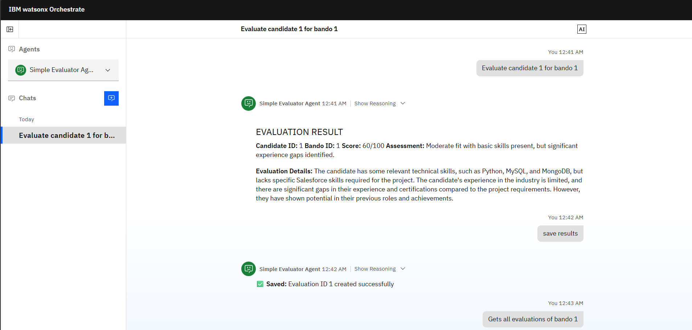

**Simple Evaluator Agent Documentation**

---

## Overview

The **Simple Evaluator Agent** is a streamlined recruitment evaluation system designed for IBM Consulting. It:

* Compares candidates against “Bando di Gara” (project tender) requirements
* Generates numerical scores (0–100) with clear assessments
* Maintains a persistent evaluation history

---

## Agent Specifications

* **Name:** `simple_evaluator_agent`
* **Display Name:** Simple Evaluator Agent
* **LLM:** `watsonx/meta-llama/llama-3-2-90b-vision-instruct`
* **Primary Function:** Candidate‑to‑project evaluation and scoring

---

## Core Workflow

The agent follows a simple 4‑step evaluation process:

1. **Get Comparison Data**

   * Retrieves both candidate and project details in a single call
   * Uses `get_comparison_data(candidate_id, bando_id)` tool

2. **Analyze & Score**

   * Reviews comparison data from Step 1
   * Generates numerical score (0–100)
   * Creates simple, clear assessment description (1–2 sentences)

3. **Save Results**

   * Stores evaluation using `save_evaluation_result()` tool
   * Persists score, assessment, and metadata to database

4. **Present Results**

   * Shows score and description to user
   * Confirms successful save with evaluation ID

---

## Scoring System

### Scoring Criteria

* **Skills Match:** Alignment between candidate skills and required skills
* **Experience Level:** Years of experience and relevance to project
* **Certifications:** Required vs. available certifications
* **Overall Project Fit:** General suitability for the project

### Scoring Scale

| Score Range | Meaning                             |
| ----------: | ----------------------------------- |
|      90–100 | Excellent match, highly recommended |
|       80–89 | Very good match, recommended        |
|       70–79 | Good match, minor gaps              |
|       60–69 | Moderate match, some concerns       |
|       50–59 | Weak match, significant gaps        |
|        0–49 | Poor match, not suitable            |

---

## Assessment Examples

* **Score 95:** “Excellent match. Skills and experience align perfectly with project requirements.”
* **Score 75:** “Good candidate with relevant skills, but lacks some advanced certifications.”
* **Score 55:** “Moderate fit with basic skills present, but significant experience gaps identified.”

---

## Available Tools

1. ### `get_comparison_data`

   **Purpose:** Retrieves complete candidate and project data for comparison
   **Parameters:**

   * `candidate_id` (string): ID of candidate to evaluate
   * `bando_id` (string): ID of Bando di Gara project
     **Returns:** JSON object with both candidate and project details

2. ### `save_evaluation_result`

   **Purpose:** Saves evaluation results to database
   **Parameters:**

   * `candidate_id` (string): Candidate ID
   * `bando_id` (string): Project ID
   * `match_score` (integer): Score from 0–100
   * `evaluation_summary` (string): Brief assessment description
     **Returns:** Confirmation with new evaluation ID

3. ### `get_evaluation_results`

   **Purpose:** Retrieves saved evaluation records
   **Parameters (all optional):**

   * `evaluation_id` (string): Specific evaluation to retrieve
   * `candidate_id` (string): All evaluations for a candidate
   * `bando_id` (string): All evaluations for a project
     **Returns:** JSON‑formatted evaluation records

---

## Usage Examples

> **Example 1: Basic Evaluation**
> **User:** “Evaluate candidate 1 for bando 1”
> **Agent Response:**
>
> ```markdown
> ## EVALUATION RESULT
> **Candidate ID:** 1  
> **Bando ID:** 1  
> **Score:** 85/100  
> **Assessment:** Very good match with strong technical skills, minor certification gaps.
>
> **Evaluation Details:**
> Candidate demonstrates excellent Java and Python skills matching project requirements.  
> 5 years experience aligns well with project complexity. Missing AWS certification  
> but has equivalent Azure experience.
>
> ✅ **Saved:** Evaluation ID 15 created successfully
> ```

> **Example 2: Retrieve Specific Evaluation**
> **User:** “Show evaluation 15”
> **Agent Response:**
>
> ```markdown
> ## EVALUATION RECORD
>
> **Evaluation ID:** 15  
> **Candidate ID:** 1  
> **Bando ID:** 1  
> **Score:** 85/100  
> **Assessment:** Very good match with strong technical skills, minor certification gaps.  
> **Created:** 2025-01-15T10:30:00
> ```

> **Example 3: Retrieve All Evaluations for a Candidate**
> **User:** “Show all evaluations for candidate 2”
> **Agent Response:**
>
> ```markdown
> ## EVALUATIONS FOR CANDIDATE 2
>
> **Evaluation ID:** 12  
> - **Bando ID:** 3  
> - **Score:** 92/100  
> - **Assessment:** Excellent match with perfect skill alignment.  
> - **Created:** 2025-01-14T14:20:00
>
> **Evaluation ID:** 8  
> - **Bando ID:** 1  
> - **Score:** 67/100  
> - **Assessment:** Moderate fit, lacks required cloud certifications.  
> - **Created:** 2025-01-12T09:15:00
> ```

> **Example 4: Multiple Evaluations**
> **User:** “Evaluate candidate 3 for bando 2, then candidate 4 for bando 2”
> **Agent Response:**
>
> ```markdown
> ## EVALUATION RESULT 1
> **Candidate ID:** 3  
> **Bando ID:** 2  
> **Score:** 78/100  
> **Assessment:** Good match with relevant experience, some skill gaps in advanced analytics.
>
> ✅ **Saved:** Evaluation ID 16 created successfully
>
> ## EVALUATION RESULT 2
> **Candidate ID:** 4  
> **Bando ID:** 2  
> **Score:** 91/100  
> **Assessment:** Excellent candidate with comprehensive skills and perfect experience match.
>
> ✅ **Saved:** Evaluation ID 17 created successfully
> ```

---

## Response Format

* **For New Evaluations:**

  ```markdown
  ## EVALUATION RESULT
  **Candidate ID:** [candidate_id]  
  **Bando ID:** [bando_id]  
  **Score:** [X]/100  
  **Assessment:** [Simple description]

  **Evaluation Details:**
  [Brief explanation of scoring reasoning]

  ✅ **Saved:** Evaluation ID [X] created successfully
  ```

* **For Retrieved Evaluations:**

  * Clear formatting of stored evaluation data
  * Chronological ordering (newest first)
  * Complete metadata display

---

## Key Features

* **Streamlined Process:** 4‑step workflow ensures consistency
* **Persistent Storage:** All evaluations saved for future reference
* **Flexible Retrieval:** Query by evaluation ID, candidate, or project
* **Consistent Scoring:** Standardized 0–100 scale with clear criteria
* **Simple Assessments:** Clear, actionable descriptions
* **Audit Trail:** Complete evaluation history with timestamps

---

## Best Practices

* Always use **exact IDs**: Ensure `candidate_id` and `bando_id` match database records
* Maintain **consistent methodology**: Apply scoring criteria uniformly
* Write **clear descriptions**: Keep assessments simple and actionable
* Follow the **complete workflow**: Always save results after generating scores
* **Retrieve before re‑evaluating**: Check existing evaluations to avoid duplicates

---

This agent provides an efficient, standardized approach to candidate evaluation while maintaining comprehensive records for recruitment decision‑making.
